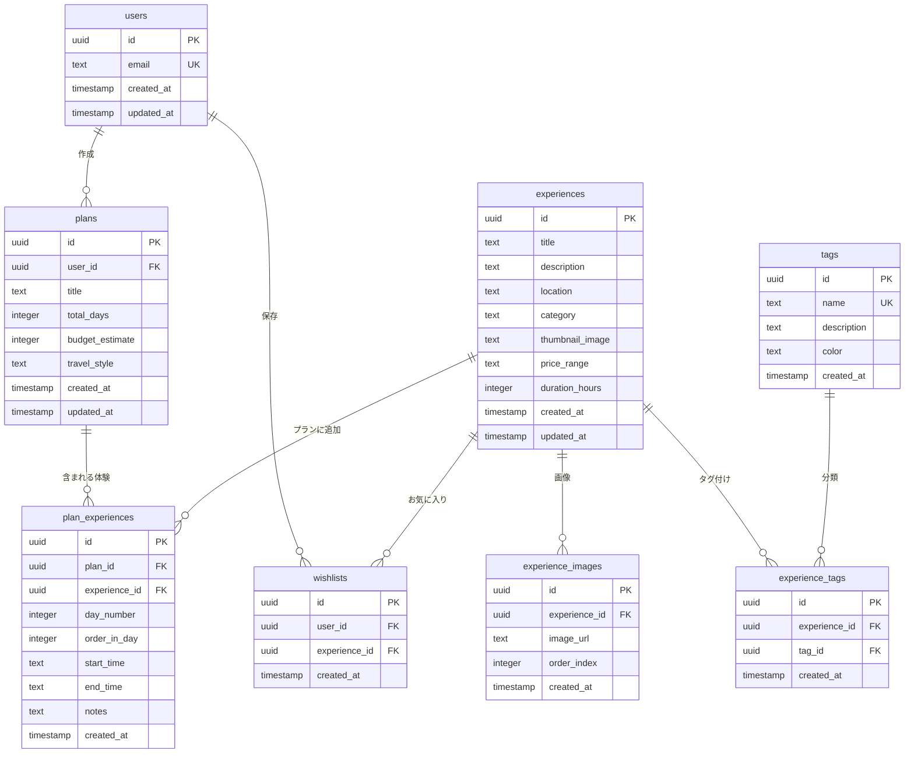

# 🗄️ データベーススキーマ設計書

## 📋 概要

TripSense JapanはSupabaseのPostgreSQLを使用し、以下の主要エンティティで構成されています：
- **users**: ユーザー認証とプロフィール情報
- **experiences**: 旅行アクティビティと観光スポット
- **experience_images**: 体験の複数画像管理
- **tags**: 旅行者タイプなどの分類タグ
- **experience_tags**: 体験とタグの多対多関係
- **wishlists**: ユーザーが保存した体験
- **plans**: ユーザー生成の旅行プラン
- **plan_experiences**: プランに含まれる体験と日程配置

---

## 🏗️ エンティティ関係図



---

## 📊 テーブル定義

### Users テーブル

```sql
CREATE TABLE users (
  id UUID PRIMARY KEY DEFAULT gen_random_uuid(),
  email TEXT UNIQUE NOT NULL,
  created_at TIMESTAMP WITH TIME ZONE DEFAULT NOW(),
  updated_at TIMESTAMP WITH TIME ZONE DEFAULT NOW()
);

-- メール検索用インデックス
CREATE INDEX idx_users_email ON users(email);

-- updated_at自動更新トリガー
CREATE OR REPLACE FUNCTION update_updated_at_column()
RETURNS TRIGGER AS $$
BEGIN
    NEW.updated_at = NOW();
    RETURN NEW;
END;
$$ language 'plpgsql';

CREATE TRIGGER update_users_updated_at 
    BEFORE UPDATE ON users 
    FOR EACH ROW EXECUTE FUNCTION update_updated_at_column();
```

**用途**: ユーザー認証とプロフィール情報の保存

### Experiences テーブル

```sql
CREATE TABLE experiences (
  id UUID PRIMARY KEY DEFAULT gen_random_uuid(),
  title TEXT NOT NULL,
  description TEXT,
  location TEXT NOT NULL,
  category TEXT NOT NULL,
  thumbnail_image TEXT, -- メイン画像（1枚）
  price_range TEXT CHECK (price_range IN ('budget', 'mid', 'luxury')),
  duration_hours INTEGER,
  created_at TIMESTAMP WITH TIME ZONE DEFAULT NOW(),
  updated_at TIMESTAMP WITH TIME ZONE DEFAULT NOW()
);

-- よく使うクエリ用インデックス
CREATE INDEX idx_experiences_category ON experiences(category);
CREATE INDEX idx_experiences_location ON experiences(location);
CREATE INDEX idx_experiences_price_range ON experiences(price_range);

-- updated_at自動更新トリガー
CREATE TRIGGER update_experiences_updated_at 
    BEFORE UPDATE ON experiences 
    FOR EACH ROW EXECUTE FUNCTION update_updated_at_column();
```

**用途**: 旅行アクティビティと観光スポットの基本情報

**カテゴリ**: `food`, `culture`, `nature`, `shopping`, `entertainment`, `relaxation`

### Experience Images テーブル

```sql
CREATE TABLE experience_images (
  id UUID PRIMARY KEY DEFAULT gen_random_uuid(),
  experience_id UUID REFERENCES experiences(id) ON DELETE CASCADE,
  image_url TEXT NOT NULL, -- Supabase Storageのパス
  order_index INTEGER DEFAULT 0, -- 表示順序
  created_at TIMESTAMP WITH TIME ZONE DEFAULT NOW()
);

-- インデックス
CREATE INDEX idx_experience_images_experience_id ON experience_images(experience_id);
CREATE INDEX idx_experience_images_order ON experience_images(experience_id, order_index);
```

**用途**: 体験の複数画像管理（カルーセル表示用）

### Tags テーブル

```sql
CREATE TABLE tags (
  id UUID PRIMARY KEY DEFAULT gen_random_uuid(),
  name TEXT UNIQUE NOT NULL,
  description TEXT,
  color TEXT DEFAULT '#3B82F6', -- タグの色
  created_at TIMESTAMP WITH TIME ZONE DEFAULT NOW()
);

-- 名前検索用インデックス
CREATE INDEX idx_tags_name ON tags(name);
```

**用途**: 旅行者タイプなどの分類タグ

**サンプルタグ**: `family`, `honeymoon`, `senior`, `adventure`, `romantic`, `budget-friendly`, `luxury`

### Experience Tags テーブル

```sql
CREATE TABLE experience_tags (
  id UUID PRIMARY KEY DEFAULT gen_random_uuid(),
  experience_id UUID REFERENCES experiences(id) ON DELETE CASCADE,
  tag_id UUID REFERENCES tags(id) ON DELETE CASCADE,
  created_at TIMESTAMP WITH TIME ZONE DEFAULT NOW(),
  UNIQUE(experience_id, tag_id)
);

-- インデックス
CREATE INDEX idx_experience_tags_experience_id ON experience_tags(experience_id);
CREATE INDEX idx_experience_tags_tag_id ON experience_tags(tag_id);
```

**用途**: 体験とタグの多対多関係

### Plans テーブル

```sql
CREATE TABLE plans (
  id UUID PRIMARY KEY DEFAULT gen_random_uuid(),
  user_id UUID REFERENCES users(id) ON DELETE CASCADE,
  title TEXT NOT NULL,
  total_days INTEGER NOT NULL,
  budget_estimate INTEGER,
  travel_style TEXT,
  created_at TIMESTAMP WITH TIME ZONE DEFAULT NOW(),
  updated_at TIMESTAMP WITH TIME ZONE DEFAULT NOW()
);

-- インデックス
CREATE INDEX idx_plans_user_id ON plans(user_id);
CREATE INDEX idx_plans_created_at ON plans(created_at);

-- updated_at自動更新トリガー
CREATE TRIGGER update_plans_updated_at 
    BEFORE UPDATE ON plans 
    FOR EACH ROW EXECUTE FUNCTION update_updated_at_column();
```

**用途**: ユーザー生成の旅行プラン

### Plan Experiences テーブル

```sql
CREATE TABLE plan_experiences (
  id UUID PRIMARY KEY DEFAULT gen_random_uuid(),
  plan_id UUID REFERENCES plans(id) ON DELETE CASCADE,
  experience_id UUID REFERENCES experiences(id) ON DELETE CASCADE,
  day_number INTEGER NOT NULL, -- 何日目か
  order_in_day INTEGER DEFAULT 0, -- その日の何番目か
  start_time TEXT, -- "09:00"
  end_time TEXT, -- "11:00"
  notes TEXT, -- メモ
  created_at TIMESTAMP WITH TIME ZONE DEFAULT NOW()
);

-- インデックス
CREATE INDEX idx_plan_experiences_plan_id ON plan_experiences(plan_id);
CREATE INDEX idx_plan_experiences_day_order ON plan_experiences(plan_id, day_number, order_in_day);
```

**用途**: プランに含まれる体験とその日程配置

### Wishlists テーブル

```sql
CREATE TABLE wishlists (
  id UUID PRIMARY KEY DEFAULT gen_random_uuid(),
  user_id UUID REFERENCES users(id) ON DELETE CASCADE,
  experience_id UUID REFERENCES experiences(id) ON DELETE CASCADE,
  created_at TIMESTAMP WITH TIME ZONE DEFAULT NOW(),
  UNIQUE(user_id, experience_id)
);

-- インデックス
CREATE INDEX idx_wishlists_user_id ON wishlists(user_id);
CREATE INDEX idx_wishlists_experience_id ON wishlists(experience_id);
```

**用途**: ユーザーが保存した体験（お気に入り）

---

## 🔒 Row Level Security (RLS)

### セキュリティポリシー

```sql
-- 全テーブルでRLSを有効化
ALTER TABLE users ENABLE ROW LEVEL SECURITY;
ALTER TABLE experiences ENABLE ROW LEVEL SECURITY;
ALTER TABLE experience_images ENABLE ROW LEVEL SECURITY;
ALTER TABLE tags ENABLE ROW LEVEL SECURITY;
ALTER TABLE experience_tags ENABLE ROW LEVEL SECURITY;
ALTER TABLE plans ENABLE ROW LEVEL SECURITY;
ALTER TABLE plan_experiences ENABLE ROW LEVEL SECURITY;
ALTER TABLE wishlists ENABLE ROW LEVEL SECURITY;

-- ユーザーは自分のプロフィールのみアクセス可能
CREATE POLICY "ユーザーは自分のプロフィールを閲覧可能" ON users
  FOR SELECT USING (auth.uid() = id);

CREATE POLICY "ユーザーは自分のプロフィールを更新可能" ON users
  FOR UPDATE USING (auth.uid() = id);

-- 体験は誰でも閲覧可能
CREATE POLICY "体験は誰でも閲覧可能" ON experiences
  FOR SELECT USING (true);

-- 画像は誰でも閲覧可能
CREATE POLICY "画像は誰でも閲覧可能" ON experience_images
  FOR SELECT USING (true);

-- タグは誰でも閲覧可能
CREATE POLICY "タグは誰でも閲覧可能" ON tags
  FOR SELECT USING (true);

-- 体験タグは誰でも閲覧可能
CREATE POLICY "体験タグは誰でも閲覧可能" ON experience_tags
  FOR SELECT USING (true);

-- プランは作成者のみアクセス可能
CREATE POLICY "ユーザーは自分のプランを閲覧可能" ON plans
  FOR SELECT USING (auth.uid() = user_id);

CREATE POLICY "ユーザーは自分のプランを作成可能" ON plans
  FOR INSERT WITH CHECK (auth.uid() = user_id);

CREATE POLICY "ユーザーは自分のプランを更新可能" ON plans
  FOR UPDATE USING (auth.uid() = user_id);

CREATE POLICY "ユーザーは自分のプランを削除可能" ON plans
  FOR DELETE USING (auth.uid() = user_id);

-- プラン体験はプラン作成者のみアクセス可能
CREATE POLICY "プラン体験はプラン作成者のみアクセス可能" ON plan_experiences
  FOR ALL USING (
    EXISTS (
      SELECT 1 FROM plans 
      WHERE plans.id = plan_experiences.plan_id 
      AND plans.user_id = auth.uid()
    )
  );

-- お気に入りはユーザーのみアクセス可能
CREATE POLICY "ユーザーは自分のお気に入りを閲覧可能" ON wishlists
  FOR SELECT USING (auth.uid() = user_id);

CREATE POLICY "ユーザーは自分のお気に入りを管理可能" ON wishlists
  FOR ALL USING (auth.uid() = user_id);
```

---

## 📈 よく使うクエリ例

### カテゴリ別体験取得

```sql
SELECT * FROM experiences 
WHERE category = 'food' 
ORDER BY created_at DESC;
```

### タグ付き体験取得

```sql
SELECT e.*, array_agg(t.name) as tags
FROM experiences e
LEFT JOIN experience_tags et ON e.id = et.experience_id
LEFT JOIN tags t ON et.tag_id = t.id
WHERE 'family' = ANY(array_agg(t.name))
GROUP BY e.id;
```

### 画像付き体験取得

```sql
SELECT e.*, 
       array_agg(ei.image_url ORDER BY ei.order_index) as images
FROM experiences e
LEFT JOIN experience_images ei ON e.id = ei.experience_id
GROUP BY e.id;
```

### ユーザーのプラン取得（体験詳細付き）

```sql
SELECT p.*, 
       pe.day_number,
       pe.order_in_day,
       pe.start_time,
       pe.end_time,
       pe.notes,
       e.title as experience_title,
       e.location,
       e.thumbnail_image
FROM plans p
LEFT JOIN plan_experiences pe ON p.id = pe.plan_id
LEFT JOIN experiences e ON pe.experience_id = e.id
WHERE p.user_id = auth.uid()
ORDER BY p.created_at DESC, pe.day_number, pe.order_in_day;
```

### ユーザーのお気に入り取得

```sql
SELECT e.*, w.created_at as saved_at
FROM wishlists w
JOIN experiences e ON e.id = w.experience_id
WHERE w.user_id = auth.uid()
ORDER BY w.created_at DESC;
```

---

## 🔄 データベースマイグレーション

### マイグレーション作成

```bash
# 新しいマイグレーション作成
supabase migration new add_user_preferences

# マイグレーション適用
supabase db push

# データベースリセット（開発時のみ）
supabase db reset
```

### 例：ユーザープリファレンス追加

```sql
-- ユーザープリファレンステーブル追加
CREATE TABLE user_preferences (
  id UUID PRIMARY KEY DEFAULT gen_random_uuid(),
  user_id UUID REFERENCES users(id) ON DELETE CASCADE,
  preferred_categories TEXT[] DEFAULT '{}',
  budget_range TEXT CHECK (budget_range IN ('budget', 'mid', 'luxury')),
  travel_style TEXT,
  created_at TIMESTAMP WITH TIME ZONE DEFAULT NOW(),
  updated_at TIMESTAMP WITH TIME ZONE DEFAULT NOW(),
  UNIQUE(user_id)
);

-- RLS有効化
ALTER TABLE user_preferences ENABLE ROW LEVEL SECURITY;

-- ポリシー追加
CREATE POLICY "ユーザーは自分のプリファレンスを管理可能" ON user_preferences
  FOR ALL USING (auth.uid() = user_id);
```

---

## 📊 サンプルデータ

### タグデータ

```sql
INSERT INTO tags (name, description, color) VALUES
('family', '家族向け', '#10B981'),
('honeymoon', '新婚旅行向け', '#F59E0B'),
('senior', 'シニア向け', '#6B7280'),
('adventure', '冒険好き向け', '#EF4444'),
('romantic', 'ロマンチック', '#EC4899'),
('budget-friendly', '予算重視', '#3B82F6'),
('luxury', '贅沢', '#8B5CF6');
```

### 体験データ

```sql
INSERT INTO experiences (title, description, location, category, price_range, duration_hours) VALUES
('浅草寺', '浅草の古い仏教寺院', '東京', 'culture', 'budget', 2),
('築地外市場', '有名な魚市場とストリートフード', '東京', 'food', 'budget', 3),
('伏見稲荷大社', '千本鳥居で有名な神社', '京都', 'culture', 'budget', 4),
('嵐山竹林', '静かな竹林散歩', '京都', 'nature', 'budget', 2),
('大阪城', '歴史的な城と博物館', '大阪', 'culture', 'budget', 3);
```

---

## 🔍 パフォーマンス最適化

### よく使うクエリ用インデックス

```sql
-- 場所とカテゴリの複合インデックス
CREATE INDEX idx_experiences_location_category ON experiences(location, category);

-- サムネイル画像ありの体験用部分インデックス
CREATE INDEX idx_experiences_with_thumbnail ON experiences(id) WHERE thumbnail_image IS NOT NULL;

-- 全文検索用GINインデックス
CREATE INDEX idx_experiences_search ON experiences USING GIN(to_tsvector('japanese', title || ' ' || description));
```

### クエリ最適化のコツ

1. **LIMIT使用**でページネーション
2. **SELECT * ではなく**必要なカラムのみ指定
3. **EXISTS使用**で大きなデータセットのIN句を避ける
4. **複雑な集計**にはマテリアライズドビューを検討

---

## 🚨 バックアップと復旧

### 自動バックアップ

Supabaseが提供する機能：
- 日次自動バックアップ
- ポイントインタイム復旧
- クロスリージョンバックアップ複製

### 手動バックアップ

```bash
# データエクスポート
pg_dump $DATABASE_URL > backup.sql

# データ復元
psql $DATABASE_URL < backup.sql
```

---

## 📚 参考資料

- [Supabase ドキュメント](https://supabase.com/docs)
- [PostgreSQL ドキュメント](https://www.postgresql.org/docs/)
- [Row Level Security ガイド](https://supabase.com/docs/guides/auth/row-level-security) 