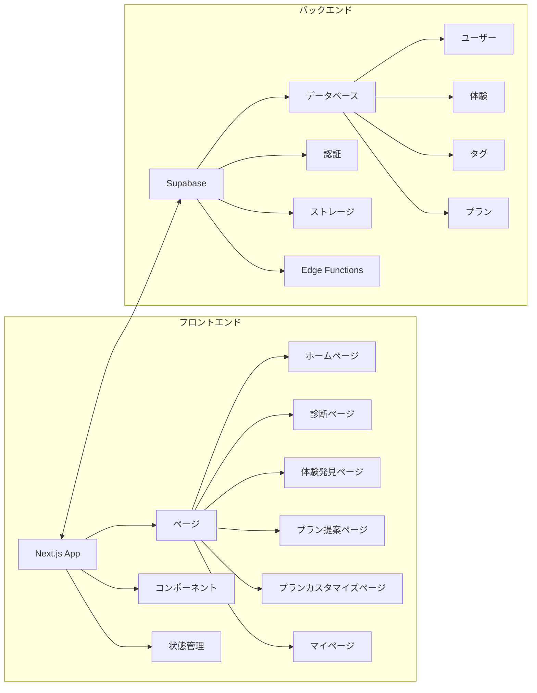
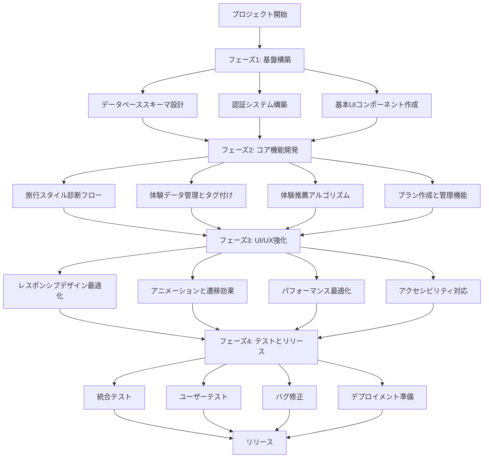
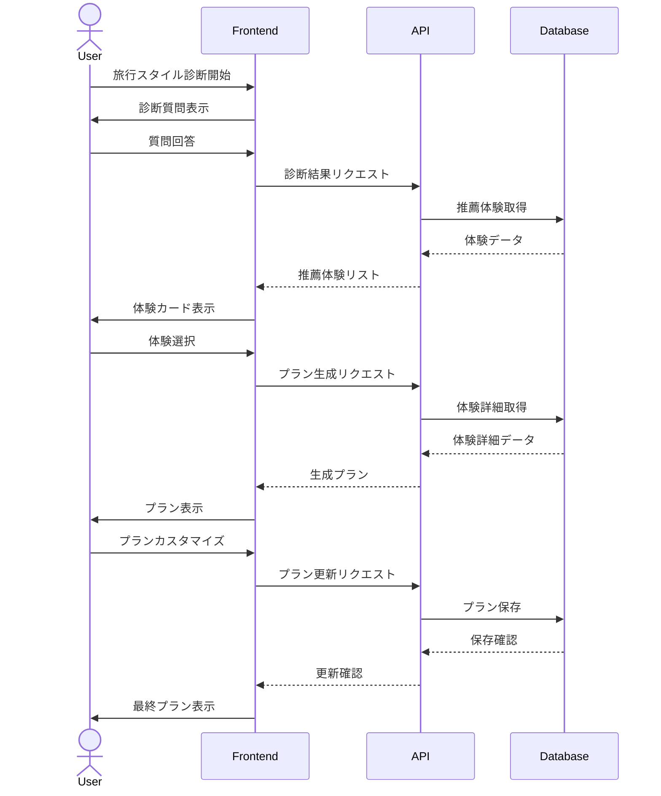
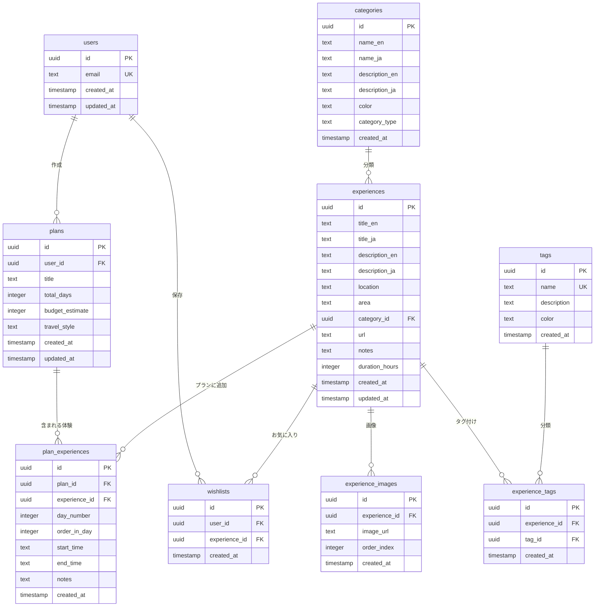

# 🚀 TripSense Japan 開発ステップ

## 📋 目次

1. [プロジェクト概要](#プロジェクト概要)
2. [開発フェーズ](#開発フェーズ)
3. [フロントエンド開発](#フロントエンド開発)
4. [バックエンド開発](#バックエンド開発)
5. [API設計](#api設計)
6. [データベース構築](#データベース構築)
7. [統合とテスト](#統合とテスト)
8. [デプロイメント](#デプロイメント)
9. [今後の拡張](#今後の拡張)

---

## プロジェクト概要

TripSense Japanは、ユーザーの旅行スタイルや好みに基づいて、パーソナライズされた日本旅行プランを提案するWebアプリケーションです。ユーザーは簡単な診断を通じて自分の旅行タイプを発見し、それに基づいたアクティビティや観光スポットの推薦を受け、カスタマイズ可能な旅行プランを作成できます。

### 主要機能
- 旅行スタイル診断
- パーソナライズされた体験推薦
- カスタマイズ可能な旅行プラン作成
- プランの保存と共有
- お気に入り体験の管理

### 技術スタック
- **フロントエンド**: Next.js (App Router), TypeScript, Tailwind CSS, shadcn/ui
- **バックエンド**: Supabase (PostgreSQL, 認証, ストレージ)
- **インフラ**: Vercel (フロントエンド), Supabase (バックエンド)

### システム構成図



---

## 開発フェーズ

### フェーズ1: 基盤構築 (4週間)
- プロジェクト設定とリポジトリ作成
- データベーススキーマ設計と実装
- 認証システム構築
- 基本UIコンポーネント作成

### フェーズ2: コア機能開発 (6週間)
- 旅行スタイル診断フロー
- 体験データ管理とタグ付け
- 体験推薦アルゴリズム
- プラン作成と管理機能

### フェーズ3: UI/UX強化 (4週間)
- レスポンシブデザイン最適化
- アニメーションと遷移効果
- パフォーマンス最適化
- アクセシビリティ対応

### フェーズ4: テストとリリース準備 (2週間)
- 統合テスト
- ユーザーテスト
- バグ修正
- デプロイメント準備

### 開発フロー図



---

## フロントエンド開発

### 1. プロジェクト構造
```
apps/
  web/
    src/
      app/             # App Router ページ
      components/      # 再利用可能なコンポーネント
      lib/             # ユーティリティ関数
      hooks/           # カスタムフック
      types/           # TypeScript型定義
      styles/          # グローバルスタイル
```

### 2. ページ構成
1. **ホームページ**
   - メインビジュアル
   - 診断開始CTA
   - 人気の体験プレビュー

2. **旅行スタイル診断ページ**
   - 質問フォーム
   - プログレスバー
   - 診断結果表示

3. **体験発見ページ**
   - 診断結果に基づく体験カード
   - 「行きたい」「気になる」選択UI
   - フィルタリングオプション

4. **プラン提案ページ**
   - 自動生成プラン表示
   - 日程表示
   - カスタマイズオプション

5. **プランカスタマイズページ**
   - 基本情報入力
   - 体験の追加・削除・並べ替え
   - 予算設定

6. **最終プランページ**
   - 完成プラン詳細
   - 予算内訳
   - 保存・共有オプション

7. **マイページ**
   - 保存済みプラン一覧
   - お気に入り体験
   - アカウント設定

### 3. コンポーネント設計
- **共通コンポーネント**
  - ナビゲーションバー
  - フッター
  - ボタン
  - カード
  - モーダル
  - フォーム要素

- **機能コンポーネント**
  - 診断質問コンポーネント
  - 体験カードコンポーネント
  - プラン日程表示コンポーネント
  - プランエディタコンポーネント
  - 予算表示コンポーネント

### 4. 状態管理
- Reactコンテキスト/フックによるローカル状態管理
- Supabase Realtime APIによるデータ同期
- ユーザー認証状態の管理

### 5. ユーザーフロー



---

## バックエンド開発

### 1. Supabase設定
- プロジェクト作成
- データベース接続設定
- 認証設定
- ストレージバケット設定

### 2. データベース実装
- マイグレーションファイル作成
- テーブル作成
- インデックス設定
- RLS (Row Level Security) ポリシー設定

### 3. 認証システム
- メール認証
- ソーシャルログイン (Google, Facebook)
- パスワードリセット
- ユーザープロフィール管理

### 4. ストレージ管理
- 画像アップロード
- ファイル構造設計
- アクセス制御

---

## API設計

### 1. Supabase APIエンドポイント
- ユーザー管理API
- 体験データAPI
- プラン管理API
- お気に入り管理API

### 2. カスタムAPI (Edge Functions)
- 診断アルゴリズムAPI
- プラン生成API
- 推薦エンジンAPI

### 3. API認証と権限
- JWTトークン認証
- RLSによる権限制御
- APIレート制限

---

## データベース構築

### 1. 主要テーブル
- users: ユーザー情報
- categories: カテゴリ情報
- experiences: 体験情報
- experience_images: 体験画像
- tags: タグ情報
- experience_tags: 体験とタグの関連
- plans: プラン情報
- plan_experiences: プランに含まれる体験
- wishlists: お気に入り情報

### 2. データ投入
1. **カテゴリデータ**
   - 旅行者タイプ (family, honeymoon, senior, adventure など)
   - コンテンツカテゴリ (food, culture, nature, shopping など)

2. **タグデータ**
   - 特性タグ (英語対応, 子連れファミリー向け, 予約必須 など)
   - 場所タグ (東京, 京都, 大阪 など)
   - 価格帯タグ (budget, mid, luxury)

3. **体験データ**
   - 基本情報 (タイトル, 説明, 場所, カテゴリ)
   - 関連タグ
   - 画像URL

### 3. インデックスと最適化
- よく使うクエリに対するインデックス作成
- 複合インデックスの設定
- クエリパフォーマンスの最適化

### 4. ER図



---

## 統合とテスト

### 1. 統合テスト
- フロントエンドとバックエンドの統合
- API呼び出しのテスト
- データフローの検証

### 2. ユーザーテスト
- ユーザビリティテスト
- A/Bテスト
- フィードバック収集と改善

### 3. パフォーマンステスト
- ロード時間測定
- ボトルネック特定
- 最適化実施

---

## デプロイメント

### 1. 開発環境
- ローカル開発環境
- Supabaseローカル開発
- テスト用データセット

### 2. ステージング環境
- Vercelプレビュー環境
- Supabaseステージングプロジェクト
- 自動デプロイ設定

### 3. 本番環境
- Vercel本番デプロイ
- Supabase本番プロジェクト
- 環境変数設定
- ドメイン設定とSSL

---

## 今後の拡張

### 1. 機能拡張
- 多言語対応
- モバイルアプリ開発
- AIによる推薦強化
- 予約統合

### 2. パフォーマンス強化
- キャッシュ戦略
- CDN最適化
- データベースシャーディング

### 3. ビジネス展開
- パートナーシップ拡大
- 収益化モデル実装
- マーケティング戦略

---

## 開発タイムライン

| 週 | フェーズ | 主要タスク |
|----|---------|-----------|
| 1-2 | 基盤構築 | プロジェクト設定、データベーススキーマ設計 |
| 3-4 | 基盤構築 | 認証システム、基本UIコンポーネント |
| 5-6 | コア機能 | 旅行スタイル診断フロー、体験データ管理 |
| 7-8 | コア機能 | 体験推薦アルゴリズム、プラン作成基本機能 |
| 9-10 | コア機能 | プラン管理、お気に入り機能 |
| 11-12 | UI/UX強化 | レスポンシブデザイン、アニメーション |
| 13-14 | UI/UX強化 | パフォーマンス最適化、アクセシビリティ |
| 15-16 | テスト・リリース | テスト、バグ修正、デプロイメント準備 |

---

## 開発リソース

### 1. ドキュメント
- [データベーススキーマ設計書](./database-schema.md)
- [開発ガイド](./development.md)
- [UX全体フロー概要](./ux.md)

### 2. デザインリソース
- ワイヤーフレーム
  - [ホームページ](./wireframes/home-page.png)
  - [旅行スタイル診断ページ](./wireframes/travel-style-quiz-page.png)
  - [診断結果ページ](./wireframes/quize-result-plus-discovery-page.png)
  - [プラン提案ページ](./wireframes/trip-plan-suggestion-page.png)
  - [プランカスタマイズページ](./wireframes/customize-your-plan-page.png)
  - [最終プランページ](./wireframes/final-trip-plan-page.png)
  - [プラン詳細ページ](./wireframes/trip-plan-detail-page.png)
  - [マイページ](./wireframes/my-page.png)

### 3. 技術リソース
- [Next.js ドキュメント](https://nextjs.org/docs)
- [Supabase ドキュメント](https://supabase.com/docs)
- [Tailwind CSS ドキュメント](https://tailwindcss.com/docs)
- [shadcn/ui コンポーネント](https://ui.shadcn.com/) 